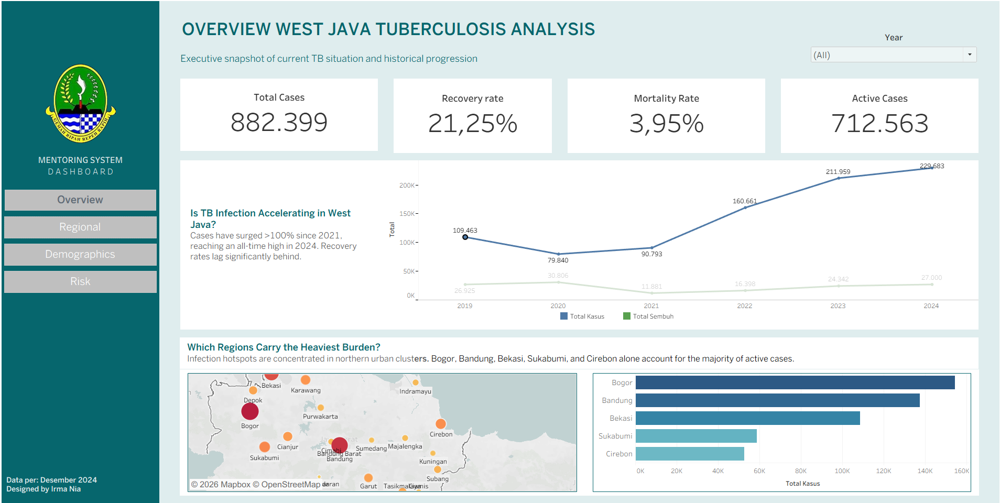

# West Java Tuberculosis Data Analysis

This repository contains analysis of tuberculosis (TB) cases data in West Java Province using data from West Java Open Data Portal. The analysis includes an interactive dashboard built with Tableau Public.

## Interactive Dashboard

**Live Dashboard**: [ristek.link/visualisasi_tbc_jabar](https://ristek.link/visualisasi_tbc_jabar)

The dashboard provides interactive visualizations with multiple tabs covering:
- **Overview**: Executive summary with key KPIs and trends
- **Regional Analysis**: TB cases distribution across West Java regions  
- **Demographics**: Analysis by gender and treatment outcomes
- **Risk Areas**: High-burden regions identification

## Data Source

Data comes from **West Java Province Open Data Portal**:
- **Website**: [opendata.jabarprov.go.id](https://opendata.jabarprov.go.id/)

## Repository Structure

### Data (`/data/`)
Tuberculosis dataset files in CSV format:

- `kasus_tuberkulosis.csv` - TB cases data by gender and region
- `terduga_tuberkulosis.csv` - Suspected TB cases data
- `tuberkulosis_diobati.csv` - TB patients under treatment data
- `keberhasilan_pengobatan_tuberkulos.csv` - TB treatment success rate data
- `kematian_pengobatan_tuberkulosis.csv` - Death during treatment data
- `kesembuhan_tuberkulosis_paru_terkonfirmasi.csv` - Pulmonary TB recovery data
- `tuberkulosis_anak.csv` - TB cases in children data
- `jenis_penyakit.csv` - Various disease types data including TB

### Dashboard (`/dashboard/`)
- `TB_Analysis_West_Java.twb` - Tableau workbook file
- Interactive dashboard with multiple analysis tabs

### SQL Scripts (`/sql/`)
- `01_schemas_and_tables.sql` - Create schemas and raw tables
- `02_staging_tables.sql` - Create staging tables
- `03_analytics_tables.sql` - Create dimension, fact, and analytics tables
- `04_etl_tuberkulosis_data_warehouse.sql` - ETL data to data warehouse
- `06_etl_analytics.sql` - ETL data to analytics tables
- `06_cek_kualitas_data.sql` - Data quality and consistency checks
- `07_insight.sql` - Queries for analysis and insights

## Data Architecture

### Database Schema
1. **raw** - Raw data from CSV files
2. **staging** - Cleaned data and dimension/fact tables
3. **analytics** - Aggregated data for reporting

### ETL Pipeline
1. Load CSV data to raw tables
2. Transform and load to staging (star schema)
3. Aggregate data to analytics tables
4. Quality checks and data validation

## How to Use

### Prerequisites
- PostgreSQL database
- SQL execution tool (pgAdmin, DBeaver, etc.)

### Steps
1. Run SQL scripts in order:
```bash
01_schemas_and_tables.sql    # Create schemas and tables
02_staging_tables.sql        # Create staging tables
03_analytics_tables.sql      # Create dimension and analytics tables
04_etl_tuberkulosis_data_warehouse.sql  # ETL to data warehouse
05_etl_analytics.sql         # ETL to analytics
```

2. Import CSV data to corresponding raw tables

3. Run analysis scripts:
```bash
06_cek_kualitas_data.sql     # Check data quality
07_insight.sql               # Generate insights
```

## Types of Analysis

- **Regional Analysis**: TB cases per regency/city
- **Gender Analysis**: Case distribution by gender
- **Treatment Analysis**: Success and mortality rates
- **Outlier Detection**: Identify regions with extreme cases
- **Temporal Trends**: TB case patterns over time

## Data Contact
- **Email**: data@jabarprov.go.id  
- **Website**: [opendata.jabarprov.go.id](https://opendata.jabarprov.go.id/)

## License
Data follows the terms of use from West Java Province Open Data Portal.

---

**Last Updated**: January 2026  
**Data Source**: West Java Province Open Data Portal