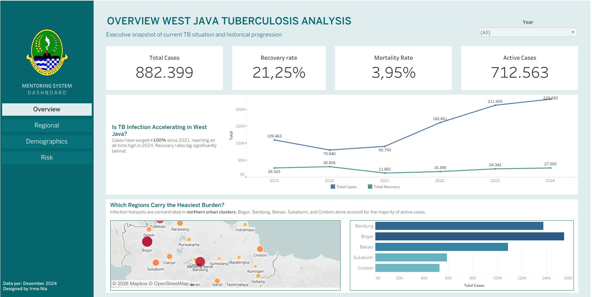

# West Java Tuberculosis Data Analysis

This repository contains analysis of tuberculosis (TB) cases data in West Java Province using data from West Java Open Data Portal. The analysis includes an interactive dashboard built with Tableau Public.

## Interactive Dashboard

**Live Dashboard**: [Link Tableau Dashboard](https://public.tableau.com/app/profile/irma.alwijah/viz/tbc-dashboard-jabar/Overview)

The dashboard provides comprehensive interactive analysis with 4 analytical tabs:
- **Overview**: Executive summary with key KPIs, temporal trends, and burden hotspots identification
- **Regional**: Regional performance analysis, treatment pipeline efficiency, and geographical distribution
- **Demographics**: Child vs adult ratio analysis (29.79% children), gender risk assessment (55% male burden), and treatment adherence gaps
- **Risk**: System performance alerts identifying 4 regions in danger, lowest recovery rates (4.49%), and highest mortality rates (7.7%)

## Key Dashboard Features

### Strategic Analysis
- **Treatment Pipeline Bottleneck Identification**: Analysis showing diagnostic rate vs recovery completion gaps
- **Resource Prioritization Matrix**: Scatter plot analysis of total cases vs treatment success rates to identify intervention priorities  
- **Urban vs Rural Comparison**: Burden distribution analysis challenging assumptions about TB concentration
- **Multi-year Growth Tracking**: Trend analysis identifying emerging hotspots (Bogor surpassing traditional centers)

### Interactive Elements
- **Year and Location Filters**: Dynamic filtering across all visualizations
- **Cross-tab Navigation**: Seamless analysis flow from overview to detailed insights
- **Actionable Insights**: Data-driven recommendations for public health decision making

## Data Source

Data comes from **West Java Province Open Data Portal**:
- **Website**: [opendata.jabarprov.go.id](https://opendata.jabarprov.go.id/)

## Repository Structure

### Data (`/data/`)
Tuberculosis dataset files in CSV format:

- `kasus_tuberkulosis.csv` - TB cases data by gender and region
- `terduga_tuberkulosis.csv` - Suspected TB cases data
- `tuberkulosis_diobati.csv` - TB patients under treatment data
- `keberhasilan_pengobatan_tuberkulos.csv` - TB treatment success rate data
- `kematian_pengobatan_tuberkulosis.csv` - Death during treatment data
- `kesembuhan_tuberkulosis_paru_terkonfirmasi.csv` - Pulmonary TB recovery data
- `tuberkulosis_anak.csv` - TB cases in children data
- `jenis_penyakit.csv` - Various disease types data including TB

### Dashboard Files
- `dashboard-tbc-jabar.twbx` - Tableau workbook file (packaged)
- Excel analysis files with pivot tables and charts
- `dashboard_picts/` - Dashboard screenshots and visualizations

### SQL Scripts (`/sql/`)
- `01_schemas_and_tables.sql` - Database schemas and raw tables setup
- `02_staging_tables.sql` - Staging tables creation (star schema)
- `03_analytics_tables.sql` - Analytics and summary tables
- `04_etl_tuberkulosis_data_warehouse.sql` - ETL Raw to Data Warehouse
- `05_etl_analytics.sql` - ETL Staging to Analytics layer
- `06_cek_kualitas_data.sql` - Data validation and quality checks  
- `07_insight.sql` - Business intelligence and analytical queries

## Data Architecture

### Database Schema
1. **raw** - Raw data from CSV files
2. **staging** - Cleaned data and dimension/fact tables
3. **analytics** - Aggregated data for reporting

### ETL Pipeline
1. Load CSV data to raw tables
2. Transform and load to staging (star schema)
3. Aggregate data to analytics tables
4. Quality checks and data validation

## How to Use

### Prerequisites
- Database system (PostgreSQL/MySQL recommended)
- Python/R for data analysis
- Visualization tools (Tableau, Microsoft Excel, Power BI, etc.)
- SQL execution tool (pgAdmin, DBeaver, etc.)

### Steps
1. Run SQL scripts in order:
```bash
01_schemas_and_tables.sql           # Create schemas and raw tables
02_staging_tables.sql               # Create staging tables  
03_analytics_tables.sql             # Create analytics tables
04_etl_tuberkulosis_data_warehouse.sql  # ETL to data warehouse
05_etl_analytics.sql                # ETL to analytics layer
```

2. Import CSV data to corresponding raw tables

3. Run analysis and quality check scripts:
```bash
06_cek_kualitas_data.sql           # Check data quality
07_insight.sql                     # Generate business insights
```

## Key Analytical Features

- **Demographics Intelligence**: 29.79% child cases with persistent 25k+ annual volume
- **Gender Risk Assessment**: Male patients account for 55% of cases, females show 88% recovery rate
- **Regional Risk Stratification**: 4 regions identified in critical danger zone
- **Performance Monitoring**: System alerts for mortality >5% and recovery <50%
- **Treatment Cascade Analysis**: Detection, treatment initiation, and success rate tracking
- **Advanced SQL Optimization**: Query optimization with selection push-down and CTE patterns

## Data Contact
- **Email**: data@jabarprov.go.id  
- **Website**: [opendata.jabarprov.go.id](https://opendata.jabarprov.go.id/)

## License
Data follows the terms of use from West Java Province Open Data Portal.

---

**Last Updated**: February 2026  
**Data Source**: West Java Province Open Data Portal